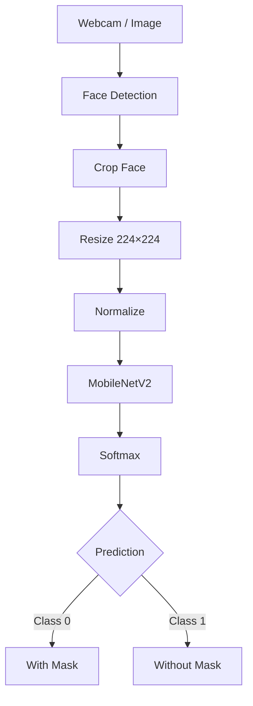
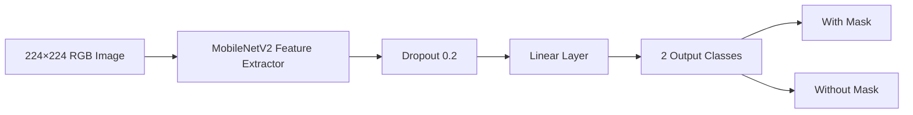
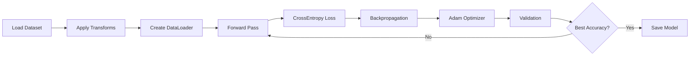
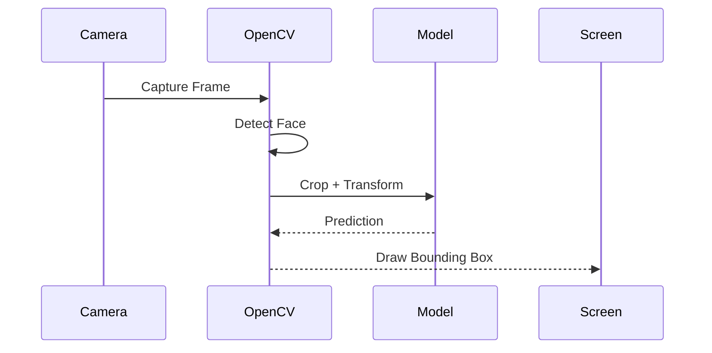

# Face Mask Detection using PyTorch

A real-time **Face Mask Detection** system built with **PyTorch**, **Torchvision**, and **OpenCV**. The project uses **Transfer Learning (MobileNetV2)** to classify detected faces as **with mask** or **without mask**.

---

## Features

* Real-time webcam detection
* Face detection using OpenCV Haar Cascade
* Transfer Learning with MobileNetV2
* Binary image classification
* Model evaluation with multiple metrics
* Single image prediction
* Modular and production-style project structure

---

## Demo Pipeline



---

# Project Structure

```text
Face-Mask-Detection/
│
├── dataset/
│   ├── with_mask/
│   └── without_mask/
│
├── models/
|   ├── haarcascade_frontalface_default.xml
│   └── best_model.pth
│
├── outputs/
│
├── src/
│   ├── config.py
│   ├── dataset.py
│   ├── transforms.py
│   ├── model.py
│   ├── train.py
│   ├── evaluate.py
│   ├── predict.py
│   ├── realtime.py
│   └── utils.py
│
├── requirements.txt
├── README.md
└── main.py
```

---

# Dataset

Download the **Face Mask Dataset** from Kaggle.

```
dataset/
│
├── with_mask/
│   ├── image1.jpg
│   ├── image2.jpg
│   └── ...
│
└── without_mask/
    ├── image1.jpg
    ├── image2.jpg
    └── ...
```

---

# Model Architecture



---

# Training Workflow



---

# Real-Time Inference



---

# Installation

Clone the repository.

```bash
git clone https://github.com/maroofiums/Face-Mask-Detection.git

cd Face-Mask-Detection
```

Create a virtual environment.

```bash
python -m venv venv
```

Activate it.

### Windows

```bash
venv\Scripts\activate
```

### Linux / macOS

```bash
source venv/bin/activate
```

Install dependencies.

```bash
pip install -r requirements.txt
```

---

# Train the Model

```bash
python src/train.py
```

The best model will be saved in

```text
models/best_model.pth
```

---

# Evaluate the Model

```bash
python src/evaluate.py
```

Metrics include:

* Accuracy
* Precision
* Recall
* F1 Score
* Confusion Matrix

---

# Predict a Single Image

```bash
python src/predict.py
```

Example output

```text
Prediction : with_mask
Confidence : 99.43%
```

---

# Run Real-Time Detection

```bash
python src/realtime.py
```

Press **Q** to exit.

---

# Technologies

* Python
* PyTorch
* Torchvision
* OpenCV
* Pillow
* NumPy
* Scikit-learn
* Matplotlib
* tqdm

---

# Future Improvements

* MediaPipe Face Detection
* YOLOv8 Face Detection
* EfficientNet
* TensorBoard Logging
* Early Stopping
* Learning Rate Scheduler
* Mixed Precision Training (AMP)
* ONNX Export
* FastAPI Deployment
* Docker Support

---

# Learning Outcomes

This project demonstrates:

* Binary Image Classification
* Transfer Learning
* Computer Vision
* OpenCV
* PyTorch
* Model Evaluation
* Real-Time Inference
* Deep Learning Project Structure

---

# License

This project is licensed under the MIT License.
